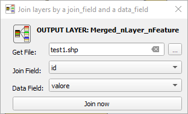
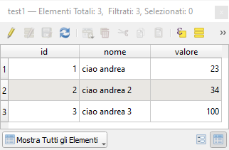
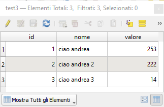
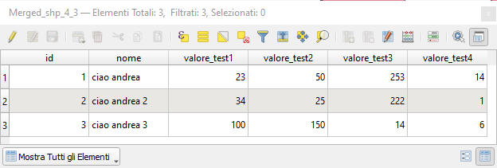

# MultiJoin
Plugin that  joins many shapes in a table given a join field and a data field to join
<html>
  <head>
    <meta http-equiv="content-type" content="text/html; charset=windows-1252">
  </head>
  <body>
    <h1 style="text-align: center;"><strong></strong></h1>
    <h1 style="text-align: center;"><strong>Multi-Join identical vectors and fields</strong></h1>
    

    <b>This plugin generates a new temporary level with all fields from a source level and further n fields taken from other n levels having the same field:</b> 
     <b>the added fields have the same name as the source field plus the file name 
     <b>Plugin Accepts multiple shapes in the same folder or single gpkg file 
     <b><mark style='color:red'>In the plugin test folder two shape folders and a folder with a gpgk</mark>

     

     
<b> First select the folder with the files to join based on an identity field and attribute </b>

     

     
<b>This is the source attribute table</b>

     

     
<b>These are the other's shape table</b>

     

     
<b><b>and this is the final result.</b></b>

  </body>
</html>